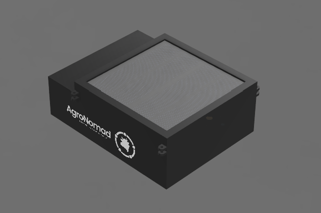
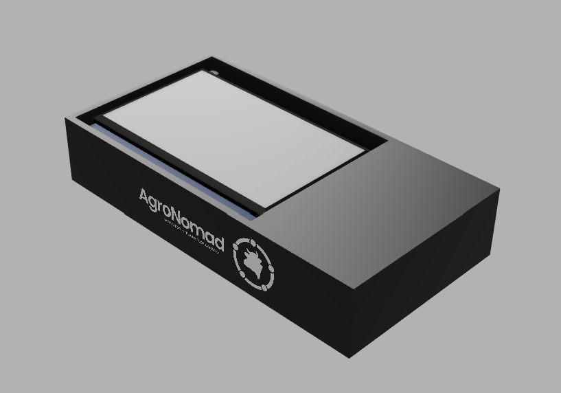

    
# [AgroNomad](https://linktr.ee/agronomad2026)

&nbsp;

| Página web | Email | Instagram | Tiktok |
|------------|-------|-----------|---------|
|[AgroNomad Page](https://agro-nomad-page.vercel.app)|nomadbusiness2026@gmail.com|[@proyecto.agronomad](https://www.instagram.com/proyecto.agronomad/)|[@proyecto.agronomad](https://www.tiktok.com/@proyecto.agronomad)|

### MONITOREO INTELIGENTE DE GANADO 

AgroNomad es un sistema de monitoreo inteligente de ganado que combina collares smart, sensores, posicionamiento GPS y comunicación LoRa para obtener información de los animales directamente desde el campo.

El sistema está compuesto por collares inteligentes, una estación de recepción fija y una interfaz de usuario que permite visualizar y gestionar la información obtenida.

---

## Objetivo

Desarrollar un sistema IoT que permita realizar el seguimiento remoto del ganado, obteniendo información sobre su ubicación, movimiento y diferentes parámetros del animal, y centralizando estos datos en una estación de control.

---

## Componentes del Proyecto  

### AgroNeck

Collar inteligente colocado en el animal.

Se encarga de adquirir y procesar la información proveniente de los sensores y transmitirla mediante LoRa hacia el AgroBot.

### AgroBot

Estación de recepción fija del sistema.

Recibe la información enviada por los AgroNeck y funciona como centro de control para los animales monitoreados.

### AgroServer

Interfaz de usuario del sistema.

Permite visualizar y gestionar la información recibida desde los AgroNeck a través del AgroBot.

---

## Estructura del Proyecto  
**docs/** Documentación e Informes del Proyecto  
**firmware/** Código de los Microcontroladores  
**hardware/** Esquemáticos y PCB  
**mechanical/** Diseños 3D  
**web/** Landing Page del Proyecto  

---

### AgroNeck  

### AgroBot

---

